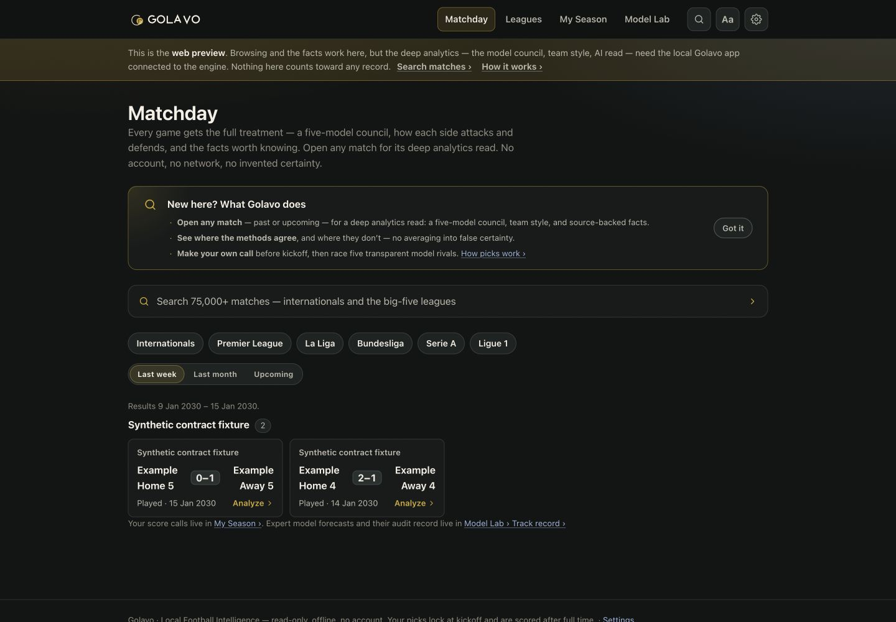
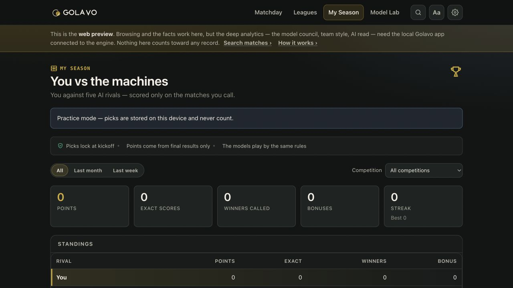
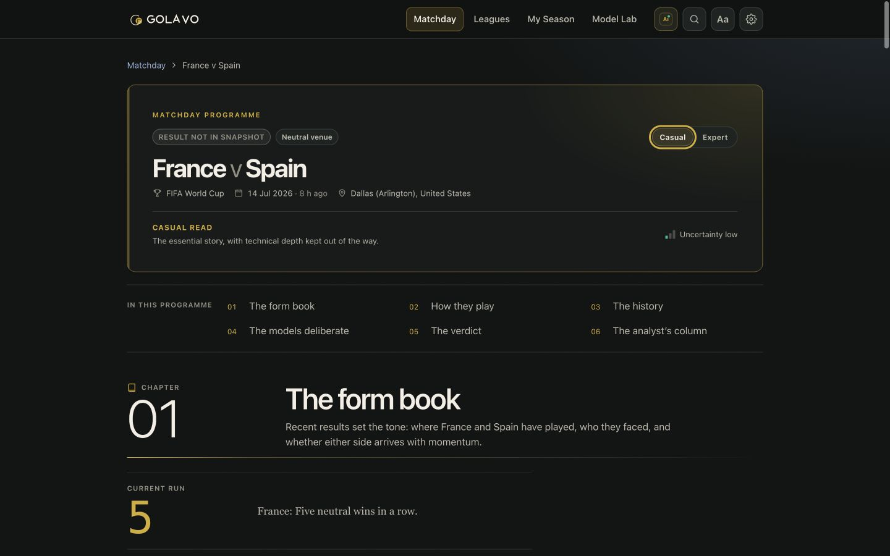
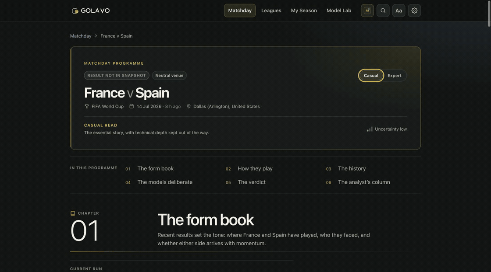
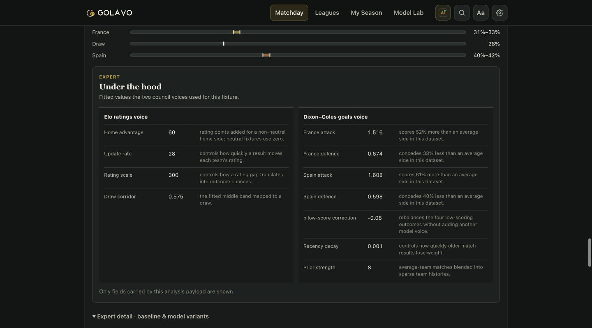
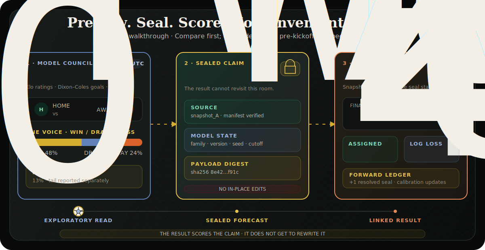
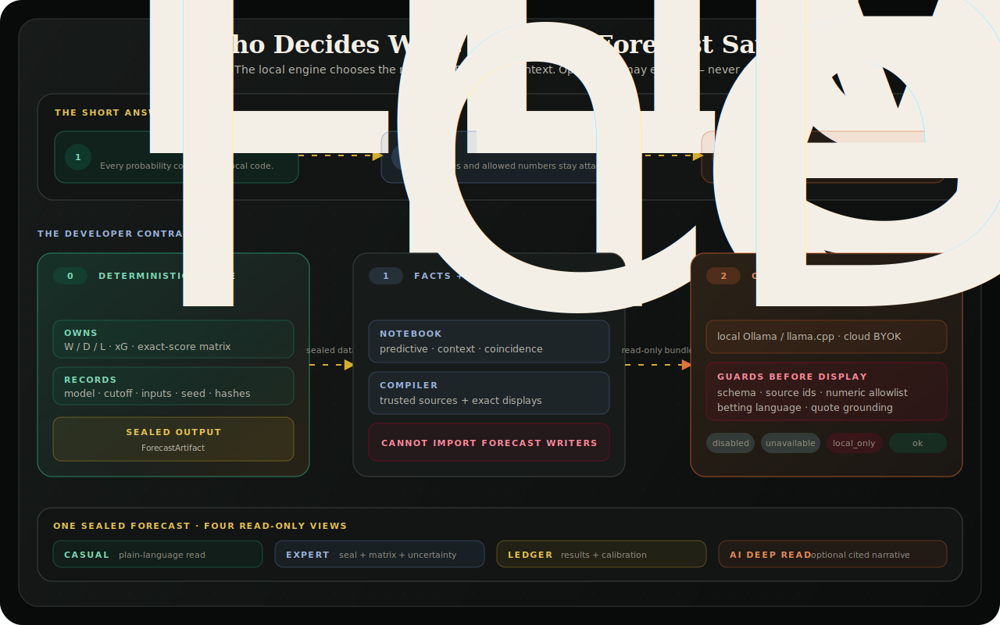
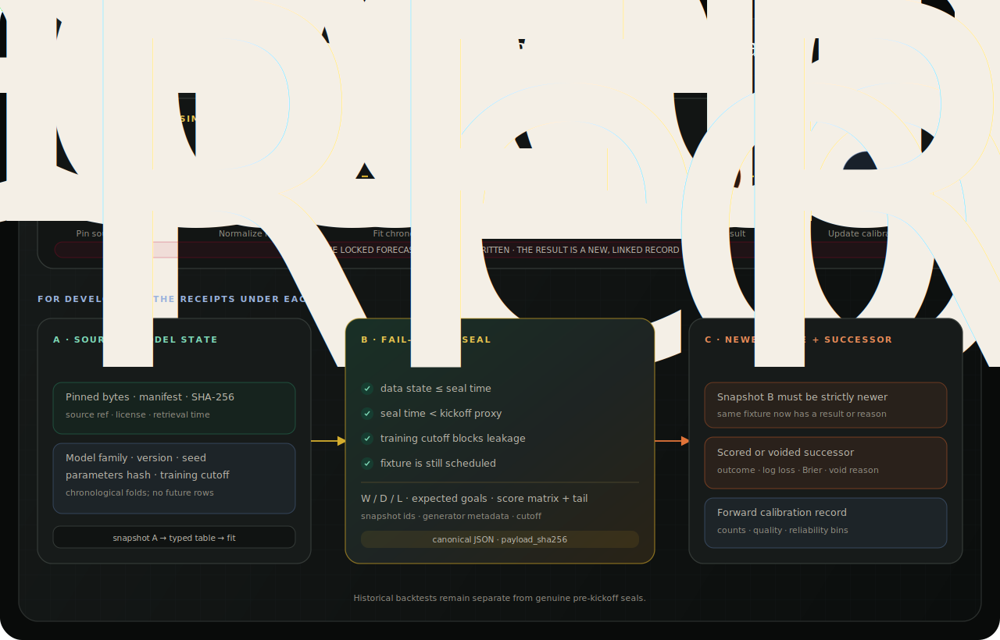
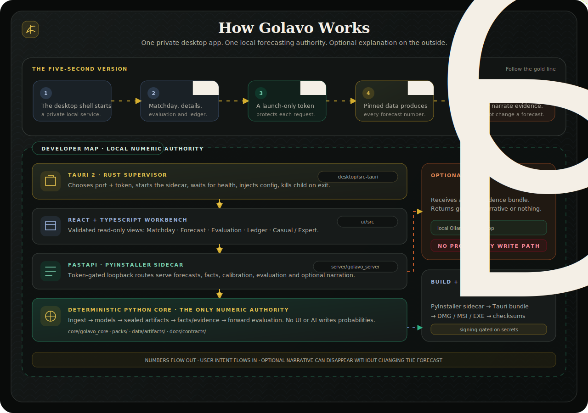

<p align="center">
  <picture>
    <source media="(prefers-color-scheme: dark)" srcset="assets/brand/animated/golavo-icon-dark.svg">
    <source media="(prefers-color-scheme: light)" srcset="assets/brand/animated/golavo-icon-light.svg">
    
  </picture>
</p>

<h1 align="center">Golavo</h1>

<p align="center"><em>The numbers remember everything. The beautiful game still keeps the last word.</em></p>

<p align="center">
  An honest, local-first football intelligence cockpit. Open any match — past or upcoming —<br>
  and see what the models predict, where they disagree, and why. Call the score,<br>
  race five transparent model rivals, or seal an expert prediction<br>
  before kickoff to put it on the record.<br>
  No odds. No oracle. No moving the goalposts.
</p>

<p align="center">
  <strong>No account</strong>&nbsp;&nbsp;·&nbsp;&nbsp;<strong>No telemetry</strong>&nbsp;&nbsp;·&nbsp;&nbsp;<strong>No invented certainty</strong>
</p>

<p align="center">
  <sub>予測&nbsp;&nbsp;the forecast&nbsp;&nbsp;·&nbsp;&nbsp;記録&nbsp;&nbsp;the record&nbsp;&nbsp;·&nbsp;&nbsp;間&nbsp;&nbsp;room for uncertainty&nbsp;&nbsp;·&nbsp;&nbsp;笛&nbsp;&nbsp;the final whistle</sub>
</p>

<p align="center">
  
  
  
  
  
  <a href="https://github.com/udhawan97/Golavo/actions/workflows/ci.yml"></a>
</p>

<p align="center">
  <a href="https://udhawan97.github.io/Golavo/#gv-install-title"><kbd>&nbsp;⬇️&nbsp;Download&nbsp;</kbd></a>&nbsp;
  <a href="https://udhawan97.github.io/Golavo/build-from-source/"><kbd>&nbsp;🌐&nbsp;Run&nbsp;in&nbsp;browser&nbsp;</kbd></a>&nbsp;
  <a href="#what-it-does"><kbd>&nbsp;📋&nbsp;Features&nbsp;</kbd></a>&nbsp;
  <a href="#the-rule-of-the-room"><kbd>&nbsp;🧠&nbsp;Local&nbsp;vs&nbsp;AI&nbsp;</kbd></a>&nbsp;
  <a href="#under-the-hood"><kbd>&nbsp;⚙️&nbsp;Architecture&nbsp;</kbd></a>&nbsp;
  <a href="https://udhawan97.github.io/Golavo"><kbd>&nbsp;📖&nbsp;Docs&nbsp;</kbd></a>
</p>

> [!WARNING]
> Golavo is a **v0.12.0 pre-alpha** with OS-unsigned installers, built in the open. The
> deterministic engine, the on-demand multi-model **Match Cockpit** (Replay for a played
> match, Preview for a scheduled one), Games-first browsing, historical backtests, the
> international seal→score loop, calibration record, optional guarded AI narration, and
> desktop packaging are implemented. Signing, notarization, live club fixtures, standings
> and season projections, observed xG/lineups/injuries, and a club forward loop are not.
> This is a football analysis workbench, **not a betting product**.

## Golavo at a glance

| If you are here to… | Start with | What you get |
| --- | --- | --- |
| **Read a match** | Games → open any past or upcoming fixture | Two separate model voices, the likely scoreline, honest disagreement, and three source-backed facts |
| **Play the season** | Make a score call on any upcoming match | A kickoff-locked pick, simple points, and a private race against five deterministic rivals |
| **Put a model prediction on the record** | Seal an eligible upcoming international | An immutable expert claim that is scored or voided later without rewriting the original |
| **Audit the system** | Model Lab | Track record, chronological backtests, methodologies, calibration, artifact hashes, and provenance |
| **Build or review the code** | [Architecture](https://udhawan97.github.io/Golavo/architecture/) → [Build from source](https://udhawan97.github.io/Golavo/build-from-source/) | The Tauri → React → FastAPI → deterministic Python boundary, typed contracts, and local verification commands |

<p align="center">
  
</p>

<p align="center">
  <sub><strong>Games first.</strong> A fresh install opens on football: search, leagues, recent results, and any honestly available upcoming fixtures.</sub>
</p>

## Play the season

Make the score call you believe before kickoff, then let the final result settle it. Your pick
locks with a SHA-256 fingerprint and joins **My Season**, a private race against five disclosed
model rivals on exactly the matches you choose to play.

<p align="center">
  
</p>

- **3 points** for the exact score, **1** for the right winner or draw, and **+1** only when
  your call strictly beats every available rival.
- Rival calls stay hidden until you save yours. Goal models call exact scores; ratings and the
  historical baseline call only the outcome. An abstaining model never gets a made-up pick.
- No money, odds, account, public leaderboard, or upload. The web preview is clearly labelled
  practice mode; the desktop app keeps picks in its local ledger.

[How picks and points work](https://udhawan97.github.io/Golavo/picks-and-points/) ·
[Match Notes and optional enrichment](https://udhawan97.github.io/Golavo/match-enrichment/)

## The Match Cockpit

Most prediction products show you a number. Golavo gives the match room to unfold: six
chapters move from recent form and fitted style through history and model disagreement to
the verdict, your call, and an optional evidence-bound analyst column. The result may humble
the model; it still cannot rewrite the original evidence.

<p align="center">
  
</p>

<p align="center">
  <sub><strong>Six chapters, one honest read.</strong> Casual keeps the story concise; Expert restores fitted values, every market row, sources, and audit context without changing a probability.</sub>
</p>

<details>
<summary>&nbsp;📖&nbsp; Watch the programme unfold</summary>

<br>

<p align="center">
  
</p>

<p align="center">
  
</p>

</details>

- **Read:** move through form, style, history, model deliberation, verdict and pick, then the optional analyst column.
- **Choose depth:** Casual presents the essential story; Expert adds fitted values, full markets, source proof, and audit detail in the same order.
- **Compare:** Elo ratings and Dixon–Coles goals stay separate, with climatology shown only as an Expert reference.
- **Seal:** for eligible upcoming internationals, freeze the model, cutoff, inputs, source state, probabilities, and digest.
- **Score:** after full time, append a scored or voided successor; never edit the original claim.

<details>
<summary>&nbsp;🔏&nbsp; See how sealing keeps the receipts</summary>

<br>

<p align="center">
  <a href="docs-site/public/assets/golavo-match-story.svg"></a>
</p>

<p align="center">
  <sub><strong>Synthetic walkthrough.</strong> The motion only traces the order; the model state, source receipt, seal, and later result remain separate and visible.</sub>
</p>

</details>

## What it does

The model gets one chance to speak before kickoff. VAR is not available for JSON.

| | Do this | Get this |
| :---: | --- | --- |
| 🔭 | **Open any match in the Match Cockpit** — past or upcoming, club or international | A six-chapter, leak-safe programme: form, fitted style, history, two separate model voices, Score Outlook, verdict and pick, plus the optional evidence-bound analyst column |
| ⚽ | **Browse Games, Leagues, and search 77,000 matches** — recent results, any upcoming fixtures, the big-five leagues, and UEFA club competitions | A useful home from the first launch, offline, with an empty ledger — the app opens on football, not on an audit form |
| 🗺️ | **Open the Conditions Snapshot** — pinned GeoNames city context, local kickoff when exact, rest since each side's previous indexed match, and an offline Natural Earth travel map | Display-only context with visible attribution and explicit unknowns; none of it enters a model |
| 🎟️ | **Make your score call** — edit until kickoff, then race five named model rivals | A fingerprinted local pick, simple 3 / 1 / +1 scoring, and My Season standings over only the matches you play |
| 📦 | **Pin lawful open data** — retain source refs, licenses, manifests, and SHA-256 hashes | A forecast that can name the exact bytes it learned from |
| 🧪 | **Test five deterministic candidates** — climatology, Elo, independent Poisson, Dixon–Coles, and bivariate Poisson | Chronological log loss, Brier, ECE, RPS, and reliability instead of a victory-lap accuracy percentage |
| 🔏 | **Track a prediction — seal before kickoff** — freeze probabilities, model version, seed, parameters, cutoff, and inputs | An immutable claim the result cannot rewrite; the cockpit’s live preview, put on the record |
| 🥅 | **Explore the Score Outlook** — key goal signals in Casual; double chance, every total-goal line, distribution, exact-score matrix, and the outcome split beyond the grid in Expert | The same goal distribution behind the 1X2 forecast, with progressive depth instead of a decorative second guess |
| 🧾 | **Score after full time** — write a linked scored or voided successor | Outcome, assigned probability, log loss, Brier, or a real void reason |
| 📈 | **Keep a forward ledger** — aggregate genuine pre-kickoff seals separately from backtests | A calibration record that starts small because history is not available on back-order |
| 🗒️ | **Read the programme evidence** — venue-aware form timelines and streaks, fitted team style, guarded goal timing, head-to-head features, signature stats and records | Source-backed evidence in an editorial hierarchy, de-duplicated from the pull numbers, with sample/freshness guards and coincidences quarantined |
| 🏆 | **Read the match's history** — club comeback/lead records from recorded half-time scores, plus a trophy-and-awards shelf on exact FIFA World Cup fixtures | Source-backed context with visible sample limits and as-of filtering, never a second forecast engine |
| 🤖 | **Enable the AI Analyst Read** *(optional)* — use the built-in Ollama guide to install a Fast or Deep model, connect llama.cpp, or bring a cloud key. Pick **Fast** (a small model, seconds) or **Deep analysis** (a bigger model, usually 5–8 minutes); optionally let it **research the web** | Opens with a one-line **verdict**, then a cited synthesis that *connects* the evidence (never authors a number), with real staged progress. Deep puts a bigger model on more of the evidence with scenarios; opt-in web research adds a separate, clearly-badged *not-engine-verified* section. A dropped claim's content is never shown |
| 👓 | **Switch Casual / Expert** | A concise editorial read or visibly deeper model values, market rows, sources, seal, provenance and score-matrix detail — same numbers, different depth |
| 🖥️ | **Run locally** — source web app or Tauri desktop shell | A private workbench with no account, ads, or hosted forecasting backend |

<details>
<summary>&nbsp;📋&nbsp; The full capability and status list</summary>

<br>

| Area | What exists today |
| --- | --- |
| **Forward forecasting** | Men's senior full internationals can move through a real pre-kickoff seal → scored/voided successor loop over retained snapshots |
| **Historical evaluation** | Internationals plus the men's top-5 European leagues, modeled independently over accepted completed seasons |
| **Artifacts** | Versioned JSON contracts for forecasts, evidence bundles, facts, and AI narration; canonical payload hashes and source snapshot ids |
| **Models** | Climatological baseline, Elo ordinal-logit, independent Poisson, time-decayed Dixon–Coles, and bivariate Poisson; no permanent champion declared |
| **Exact scores** | Goal-based seals include the coherent score grid they already imply, including an explicit high-score tail |
| **Match Cockpit** | On-demand analysis for **any** indexed match at the seal's own `kickoff − 1s` cutoff: a **Replay** or **Preview** arranged as six programme chapters. Casual keeps the essential story; Expert exposes fitted model internals, complete market rows, source proof, and the coherent score grid — machine-checked leak-safe, never averaged |
| **Navigation** | Games-first home (recent + upcoming rails, offline), Leagues browse hub, and a Model Lab that holds Track record, Backtests, Methodologies, and the sealed-forecast list. Old `#/ledger` and `#/eval` links redirect into the Lab |
| **Conditions Snapshot** | Read-only rest and travel context from the local index plus pinned GeoNames and Natural Earth side tables. City resolution is exact-name and country scoped; stadium remains unknown without a stadium-level source. Labeled “Context, not a model input.” |
| **Your Call / My Season** | Kickoff-locked score picks with SHA-256 integrity, durable local storage, five deterministic rivals, 3 / 1 / +1 scoring, standings, history, filters, cumulative points, and streaks |
| **Workbench** | Match cockpit, forecast detail, historical Backtests, forward Track record, provenance, scored/voided/superseded states, Casual and Expert presentation, "three things to know" insight cards, re-seal "what moved" deltas, and reading-comfort themes (incl. a warm low-blue mode) |
| **Facts** | Pre-registered deterministic templates; sample/freshness/base-rate guardrails; coincidences capped and quarantined |
| **AI Deep Read** | Implemented, off by default, and additive; Settings and the match panel include an Ollama setup/download guide with real readiness, progress and cancellation. Local Ollama/llama.cpp and BYOK reads all pass schema, citation, numeric-whitelist, grounding, and betting-language guards that fail closed to local-only |
| **Desktop** | Tauri 2 shell supervising a PyInstaller/FastAPI sidecar on an ephemeral loopback port with a fresh per-launch token |
| **Distribution** | macOS DMG and Windows MSI/EXE builds plus checksums; **signed in-app updates** (consent-first, verified, ledger backed up first) from v0.2.1; OS signing/notarization still gated on real credentials |
| **Not yet shipped** | Confirmed-lineup/BYOK data adapters, scorers, corners, cups, club forward forecasting, hash-chained multi-artifact ledger, signed public release |

</details>

## The rule of the room

**The statistical engine owns every number.** Not the interface. Not the prose. Not
the AI wearing a very confident scarf.

| | Statistical engine | Optional AI layer |
|---|---|---|
| **Owns** | Every probability, expected-goal value, score matrix, and evaluation metric | A one-line verdict, narrative, and scenario explanation |
| **Receives** | Pinned, typed local data | A deterministic evidence bundle with exact allowed numbers and sources |
| **May** | Rerun when a confirmed fact becomes a typed feature *(full workflow planned)* | Cite facts, connect the evidence, and — only if you opt in — add web-researched context in a clearly-separated, *not-engine-verified* lane |
| **May never** | Hide a failed seal or rewrite history | Invent, adjust, override, or loosely paraphrase an engine number |

The **Commentator's Notebook** sits between statistics and prose. Its fact templates
are deterministic and source-backed; a machine-checked dependency rule prevents them
from importing forecast, model, or calibration writers. Coincidences are welcome in
the pub. They do not get a key to the model.

AI is **off by default**. When enabled, the read opens with a one-line **verdict** (the
engine's most likely outcome) and then *connects* the evidence rather than restating it.
Every claim must survive schema validation, source checks, an exact numeric whitelist,
quote grounding where required, and a betting-language filter. A failed response becomes
`local_only`; the forecast carries on untouched.

Turning on **web research** (a separate, off-by-default setting) lets a read fetch a few
Wikipedia pages and a web search for the fixture and add an **"Analyst research"** section
— clearly badged **not engine-verified**, with each finding quoting its source page
verbatim and its numbers checked against that quote, never against the engine. It is the
only setting that lets the app reach the general web. The AI may explain the scorecard,
and cite the wider world beside it — but it may not borrow the pen.

<details>
<summary>&nbsp;🦙&nbsp; Run Fast and Deep locally with Ollama — no terminal required</summary>

1. Open **Settings → Local intelligence**. The setup guide is visible even while AI is Off.
2. Install and open [Ollama for macOS](https://ollama.com/download/mac), then choose
   **Check again**. Golavo talks only to Ollama on this Mac.
3. Download the recommended **Fast** model (`llama3.2:latest`, about 2.0 GB) or
   **Deep** model (`gemma4:12b-it-qat`, about 7.2 GB) inside Golavo. Progress and
   cancellation stay in the app; selecting a model enables Local · Ollama automatically.

The same guide is available beside the AI controls on a match. Nothing downloads until
you click, and installing a model never uploads match data. See the full
[local model guide](https://udhawan97.github.io/Golavo/ai/providers/#set-up-ollama-inside-golavo).

</details>

<p align="center">
  <a href="docs-site/public/assets/golavo-intelligence-boundary.svg"></a>
</p>

More detail: [Local Intelligence](https://udhawan97.github.io/Golavo/local-intelligence/) ·
[AI providers and guards](https://udhawan97.github.io/Golavo/ai/providers/) ·
[Fact & Coincidence engine](https://udhawan97.github.io/Golavo/methodology/facts/)

## How a forecast earns the right to exist

<p align="center">
  <a href="docs-site/public/assets/golavo-forecast-lifecycle.svg"></a>
</p>

1. **Retain the source state.** A refresh writes a new pack; old packs stay put.
2. **Normalize and fit chronologically.** Future matches are not allowed to wander
   into the training room wearing a fake moustache.
3. **Pass the seal gate.** Data state ≤ seal time, seal time &lt; kickoff proxy,
   training rows ≤ cutoff, target fixture still scheduled.
4. **Write the claim.** Probabilities, score matrix, model metadata, source ids, and
   canonical payload digest become one `ForecastArtifact`.
5. **Wait for a newer source state.** No result is invented because everyone is impatient.
6. **Write a successor.** Score it, or void it with a reason. Never edit the seal.
7. **Update forward calibration.** Genuine seals only; historical backtests stay in
   their own dressing room.

Most source rows publish dates without a verified UTC instant, so Golavo marks them
`kickoff_precision=day` and uses 00:00 UTC on match day as a conservative proxy. A pinned
World Cup overlay sharpens only exact matches to `kickoff_precision=exact`; OpenFootball's
naive venue-local club clocks are never relabeled as UTC. Forwardness is proven by public
git history: the seal must be published before that proxy. The artifact bytes prove
integrity; publication history proves timing. Different receipts, different jobs.

## Coverage — no dramatic hand-waving

Golavo's **forward** surface is men's senior full internationals. The top-5 European
leagues are a **historical backtesting** surface, while the three UEFA club competitions
are a **historical browsing and competition-local analytics** surface. They are not live
club forecasting. Each competition is modeled independently; there is no cross-competition
strength calibration.
Lineups, injuries, corners, xG, and proprietary feeds are not quietly inferred from
vibes.

Display context is separate from match rows and models: GeoNames CC BY 4.0 provides a
pinned city-country lookup (1,828 of 2,215 indexed pairs resolved at this snapshot), and
Natural Earth v5.1.1 provides the public-domain offline basemap. Missing places, travel
origins, local times, and stadiums render as unknown rather than being guessed.

| Scope | Accepted results coverage | Deeper event data | Product use |
|---|---|---|---|
| **Men's senior full internationals** | Pinned `martj42/international_results` CC0 snapshots | Goalscorers/shootouts present but not modeled; former names consumed | **Forward seal→score** + historical evaluation |
| **English Premier League** | 15 clean seasons, 2010-11→2024-25 | Not in accepted pack | Historical evaluation only |
| **La Liga** | 12 clean seasons, 2012-13→2023-24 | Not in accepted pack | Historical evaluation only; incomplete 2024-25 excluded |
| **Bundesliga** | 15 clean seasons, 2010-11→2024-25 | Not in accepted pack | Historical evaluation only |
| **Serie A** | 11 clean seasons, 2013-14→2023-24 | Not in accepted pack | Historical evaluation only; incomplete 2024-25 excluded |
| **Ligue 1** | 10 clean seasons, 2014-15→2024-25 | Not in accepted pack | Historical evaluation only; abandoned 2019-20 excluded |
| **UEFA Champions League** | 6 complete main-competition editions, 2020-21→2025-26 | Not in accepted pack | Historical browsing + competition-local strength/rest analytics |
| **UEFA Europa League** | 5 complete main-competition editions, 2020-21→2024-25 | Not in accepted pack | Historical browsing + competition-local strength/rest analytics |
| **UEFA Conference League** | 4 complete main-competition editions, 2021-22→2024-25 | Not in accepted pack | Historical browsing + competition-local strength/rest analytics |

Every partial 2025-26 domestic-league capture is excluded. UEFA qualifiers are not bundled,
and historical results do not imply a complete future schedule. Free access is not the same as
lawful open data, and a filename is not a provenance strategy. Read the
[coverage audit](docs/handoff/openfootball-audit.md) or the
[data-source guide](https://udhawan97.github.io/Golavo/data/coverage/) for the
season-by-season verdicts.

## Download or run locally

Choose one of three local-first paths. The
[website download section](https://udhawan97.github.io/Golavo/#gv-install-title)
detects macOS or Windows and links directly to the matching installer in the newest
stable release.

| Run Golavo as… | Platforms | Start here |
|---|---|---|
| **Local browser UI** | macOS, Windows, Linux | [Browser setup](https://udhawan97.github.io/Golavo/build-from-source/) |
| **macOS desktop app** | Apple Silicon | [Download the latest DMG](https://github.com/udhawan97/Golavo/releases/latest) |
| **Windows desktop app** | x64 Windows 10/11 | [Download the latest EXE or MSI](https://github.com/udhawan97/Golavo/releases/latest) |

The macOS and Windows downloads include Golavo's signed in-app updater. After you opt
into automatic checks, the app asks GitHub once a day and shows an in-app notification
when a newer stable release is available. Downloads and installation still require an
explicit click; **Settings → Updates** also provides a manual check at any time.

### Run locally in your browser

Requires Python 3.12+ and Node 22+.

```bash
git clone https://github.com/udhawan97/Golavo.git
cd Golavo
cp .env.example .env      # optional; local forecasting needs no key
make setup
make dev
```

Golavo starts the local API and UI together, then opens `http://127.0.0.1:5173`.
Press `Ctrl+C` to stop both. Use `python scripts/dev.py --no-open` to skip opening
a new tab. On Windows without `make`, the
[browser setup guide](https://udhawan97.github.io/Golavo/build-from-source/#windows-powershell-without-make)
includes native PowerShell commands.

> [!TIP]
> No AI key is required. In fact, no AI is required. The numbers will cope.

### Desktop app

Use the platform-aware download buttons on the [Golavo website](https://udhawan97.github.io/Golavo/#gv-install-title),
or browse [GitHub Releases](https://github.com/udhawan97/Golavo/releases). To build an
installer yourself:

```bash
packaging/build.sh aarch64-apple-darwin      # macOS → DMG + app
packaging/build.sh x86_64-pc-windows-msvc   # Windows → MSI + EXE
```

Outputs and per-target `SHA256SUMS-<target>` files land in `packaging/out/`.
These builds are **OS-unsigned**: macOS requires right-click → **Open** on first
launch; Windows requires **More info → Run anyway**. That warning is the
operating system accurately describing the missing certificate, not Golavo
asking you to lower your standards.

**Updates are a different story**: from the first updater-enabled release
(v0.2.1) the desktop app updates itself in-app — consent-first daily checks
(off until you say yes; the local-first promise holds), cryptographically
signed and verified downloads, a ledger backup before every install, and a
health-checked first boot that restores the backup and explains itself if the
new version can't start. Installs of v0.2.0 and earlier predate the updater:
update from them with one manual download. OS signing and notarization remain
gated on credentials the project does not yet hold — Golavo would rather show
an honest warning than cosplay as a notarized release. See
[Installation](https://udhawan97.github.io/Golavo/installation/) and
[Updates & rollback](https://udhawan97.github.io/Golavo/updates-rollback/).

## Privacy

Golavo is local-first by architecture, not by a privacy toggle hidden under seventeen
cookie banners.

- 🖥️ **Forecasting runs locally.** Core computation and normal API reads use files
  already on your machine.
- 👤 **No account.** There is no hosted Golavo user database because there is no
  hosted Golavo backend.
- 📡 **No telemetry or ads.** The workbench has nothing useful to tell an analytics
  company, and no analytics company has been invited.
- 🔄 **Data sync is explicit.** Building a new source pack uses the network and records
  the source, ref, license, retrieval time, and hashes.
- 🤖 **AI is explicit.** Local models stay on loopback. Cloud AI uses your own key only
  after you choose it; the key stays in environment/Keychain handling and is never
  written into artifacts, prompts, logs, caches, or responses.
- 🔐 **The desktop sidecar stays private.** It binds to an ephemeral `127.0.0.1` port
  behind a fresh per-launch token and dies with the app.

> The short version: Golavo does not know who you are. Your centre-back may still
> know exactly what you shouted at the screen.

## Under the hood

*For developers, researchers, contributors, and people who read model cards for fun.*

| | |
|---|---|
| **Core** | Python 3.12+ · pandas · NumPy · SciPy · PyArrow/Parquet |
| **Models** | Climatology · Elo ordinal-logit · independent Poisson · time-decayed Dixon–Coles · bivariate Poisson |
| **API** | FastAPI sidecar · read-only forecast/facts/evaluation/calibration routes · optional guarded narrative endpoint |
| **Interface** | React · TypeScript · Vite · hand-rolled SVG reliability and score-matrix views |
| **Desktop** | Tauri 2 / Rust supervisor · PyInstaller sidecar · ephemeral loopback token |
| **Artifacts** | Versioned JSON schemas · canonical SHA-256 payloads · retained source manifests |
| **Evaluation** | Chronological folds · log loss primary · Brier · ECE · RPS · forward calibration kept separate |
| **Docs** | Astro + Starlight on GitHub Pages |
| **Distribution** | GitHub Actions · unsigned DMG / MSI / EXE · checksums · signing-capable gated path |

<p align="center">
  <a href="docs-site/public/assets/golavo-system-architecture.svg"></a>
</p>

The packaged request path is deliberately boring:
**Tauri webview → token-protected FastAPI sidecar → deterministic core → local artifacts**.
Boring is excellent when the alternative is “the AI changed 47% to 51% because it felt
momentum in the second paragraph.”

<details>
<summary>&nbsp;📁&nbsp; Project layout</summary>

<br>

```text
core/       Python modeling library — ingest, models, artifacts, evaluation, facts, evidence
server/     FastAPI app — local routes and the optional AI gateway
ui/         React + TypeScript Forecast Audit Workbench
desktop/    Tauri 2 shell — sidecar lifecycle, runtime bootstrap, gated updater
packaging/  PyInstaller + Tauri bundle scripts and checksums
packs/      pinned data packs, manifests, licenses, retained snapshot registry
data/       typed tables, real forward artifacts, and audit records
docs/       contracts, ADRs, source audits, and implementation handoffs
docs-site/  Astro + Starlight product documentation
scripts/    provenance, artifact, release, and sourcepack validation
```

</details>

<details>
<summary>&nbsp;🔨&nbsp; Build, test, and validate</summary>

<br>

```bash
make setup
make test
make lint
make validate
make build
```

The release path freezes the sidecar, builds the UI, bundles the platform app,
emits checksums, and only enables signing/updating when the required secrets are
actually present. The architecture guide documents the full route map, lifecycle,
failure behavior, and trust boundaries.

</details>

Read the [architecture guide](https://udhawan97.github.io/Golavo/architecture/) ·
[prediction methodology](https://udhawan97.github.io/Golavo/methodology/prediction/) ·
[model cards](https://udhawan97.github.io/Golavo/methodology/model-cards/) ·
[prediction ledger](https://udhawan97.github.io/Golavo/prediction-ledger/)

## Methodology — humility, but with equations

Golavo evaluates five deterministic candidates on chronological folds. Log loss is
primary; Brier, ECE with reliability bins, and RPS provide the supporting argument.
On the accepted historical folds, every candidate beats the climatological baseline
on log loss, but the best family varies. No permanent champion has been crowned.
Football has seen enough managers appointed after three good matches.

Forward evidence has its own Ledger view and API. Real seals are scored after full
time and added to running calibration; historical folds never sneak into that count.

> [!NOTE]
> Golavo does **not** claim that AI, deep learning, head-to-head trivia, or a
> “new-manager bounce” improves accuracy without forward evidence. A compelling
> anecdote is still just an anecdote in a nice jacket.

## Roadmap

Golavo is useful today and nowhere near finished. A roadmap is a direction of travel,
not a legally binding promise made to a spreadsheet.

The shipped product already includes the deterministic engine, historical top-5 league
backtests, the international forward seal→score loop, desktop apps with signed in-app
updates, optional guarded AI, the Commentator's Notebook, exact-score grids, Match
Cockpit, Model Lab, and My Season. Those are current capabilities, not future
roadmap items.

| Remaining workstream | What remains | Gate |
|---|---|---|
| **Live club forecasting** | lawful live club fixtures, user-initiated refresh, and a club forward seal→score loop | verified source license, cadence, and cutoff semantics |
| **League Outlook** | standings and season projections | complete live season state and forward validation |
| **Observed match data** | optional verified lineups, injuries, xG, scorers, corners, and cups | lawful licensed source; typed provenance-safe adapters |
| **Ledger longevity** | cross-artifact hash chaining and verification | migration and recovery design proven against existing ledgers |
| **Distribution trust** | OS-signed Windows installers and signed/notarized macOS releases | real platform signing credentials and release-matrix validation |
| **Product reach** | dossiers, signed community packs, i18n, and opt-in license-isolated overlays | source-specific review and isolation tests |

Entry criteria, kill switches, and the less photogenic details live in the
[full roadmap](https://udhawan97.github.io/Golavo/roadmap/).

## Contributing

Bug reports, model critiques, data-source audits, and focused pull requests are welcome.
Start with [CONTRIBUTING.md](CONTRIBUTING.md) and the
[Code of Conduct](CODE_OF_CONDUCT.md). If a change touches a model, bring a
chronological backtest. If it makes an accuracy claim, bring forward evidence.
If it adds “guaranteed lock,” bring an eraser.

Golavo code is Apache-2.0. Data packs carry their own licenses and must declare
provenance explicitly. No source, no ship.

## License

Golavo's code is available under the [Apache License 2.0](LICENSE). Data packs are
licensed separately: the vendored international and OpenFootball packs are
`CC0-1.0`, while the isolated Fjelstul World Cup history pack is
`CC-BY-SA-4.0`. All three source families are free/open data; attribution,
isolation, and field-level decisions live in [THIRD_PARTY_NOTICES.md](THIRD_PARTY_NOTICES.md),
[NOTICE](NOTICE), and the [data-source guide](https://udhawan97.github.io/Golavo/data/sources/).

---

<p align="center">
  If Golavo rescued you from a prediction thread beginning with
  <em>“trust me, I watch a lot of football”</em>,
  <a href="https://github.com/udhawan97/Golavo/stargazers">star the repo</a>.<br>
  There is no telemetry, so stars are still the only applause the model can measure. ⭐
</p>

<p align="center">
  <sub>Built local-first, audited in public, and permanently aware that football may ignore the spreadsheet.</sub>
</p>

<sub>Golavo is not affiliated with, endorsed by, or sponsored by FIFA, UEFA, any league, club, or competition. Competition names are used factually to identify matches. No official logos, emblems, mascots, trophy imagery, crests, or kit designs are used.</sub>
