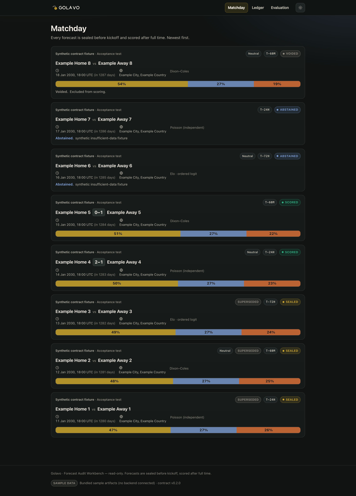

<div align="center">

<picture>
  <source media="(prefers-color-scheme: dark)" srcset="assets/brand/animated/golavo-lockup-dark.svg">
  <source media="(prefers-color-scheme: light)" srcset="assets/brand/animated/golavo-lockup-light.svg">
  
</picture>

### The numbers remember everything. The beautiful game still keeps the last word.

**Open-source, local-first soccer forecasting for full internationals.**
It began as a deterministic local forecasting spike for men's senior full internationals; it now also backtests the men's top-5 European leagues (historical), ships an optional local-first AI narration layer (off by default, never owns a number), and builds an unsigned desktop app. Remaining scope — confirmed-lineup / BYOK data adapters, scorers, cups, and a signed release — is tracked in [ADR-0001](docs/adr/0001-architecture.md).

<!-- Badges resolve once the repo is public on GitHub. -->
[](https://github.com/udhawan97/Golavo/actions/workflows/ci.yml)
[](https://github.com/udhawan97/Golavo/actions/workflows/release.yml)
[](https://udhawan97.github.io/Golavo)
[](LICENSE)

[**Website & Docs**](https://udhawan97.github.io/Golavo) · [Methodology](https://udhawan97.github.io/Golavo/methodology/prediction/) · [Coverage](https://udhawan97.github.io/Golavo/data/coverage/) · [Roadmap](#roadmap)

</div>

> [!WARNING]
> **Status: v0.1.0 — unsigned pre-alpha.** Working today: pinned CC0 snapshots with retained history; historical backtests (internationals + top-5 European leagues); a reproducible seal-before-kickoff → score-after-full-time loop for internationals with a real calibration record (which **starts empty** and only ever holds genuine pre-kickoff seals); an optional local-first AI narration layer that is **off by default** and can never change a number; and a Tauri desktop app that builds **unsigned** (the macOS bundle is verified locally; macOS + Windows bundles are built by the release workflow on tag). Signing/notarization, the signed auto-updater, confirmed-lineup / BYOK data adapters, club forward loops, scorers, and cups remain planned or gated ([ADR-0001](docs/adr/0001-architecture.md)). Nothing here is a betting product.

---

<div align="center">



<sub>The read-only workbench (v0.1.0) over the bundled **synthetic sample artifacts** — labelled as sample data in-app, never shown as real forecasts. More: [AI Deep Read off](docs-site/public/screenshots/ai-deep-read-off.png) · [on](docs-site/public/screenshots/ai-deep-read-on.png) · [calibration record](docs-site/public/screenshots/calibration-ledger.png).</sub>

</div>

## What Golavo is

Golavo builds a reproducible 1X2 forecast for a men's senior full international, then **seals** a versioned JSON artifact with its model and source snapshot. A later, strictly-newer snapshot produces a separate scored artifact without rewriting the seal — and since Phase 3 this forward loop is real: sealed fixtures accumulate in a public ledger (`data/artifacts/`), postponements void with a recorded reason, and a read-only calibration record tracks running log loss and reliability over genuine seals, separately from backtests. The source gives dates but not kickoff times, so seals close at a conservative day-before (00:00 UTC) cutoff; forwardness is proven by pre-kickoff publication in this repository's git history. Exact-score presentation, goalscorers, corners, cups, and a club forward loop are planned in [ADR-0001](docs/adr/0001-architecture.md).

**What Golavo is not:** a livescore app (open-core results are delayed), a betting tool (no odds, no picks, no "locks," no bankroll advice), a redistributor of licensed data feeds, or an "AI predictor" (the statistics own the numbers).

## The Local vs AI contract

| | The statistical engine | The AI layer (optional) |
|---|---|---|
| **Owns** | Every probability, score matrix, and count distribution | Narrative, scenario explanation, research |
| **May** | Rerun when a *confirmed* new fact becomes a typed feature | Surface cited facts and propose typed features for the engine |
| **May never** | — | Silently change a probability, or state a number not in its evidence bundle |

The optional AI layer is **implemented in Phase 5 and off by default**; typed-feature reruns from confirmed facts remain **planned (ADR-0001)**. The AI reads and cites the engine's numbers over a deterministic evidence bundle and is structurally prevented from stating any number the engine did not produce — a numeric whitelist rejects the whole narration otherwise, falling back to local-only. It **does not improve accuracy** and cannot change a probability. See the [Phase 5 handoff](docs/handoff/codex-phase5.md).

Since Phase 7, the **Commentator's Notebook** supplies the AI's cited facts deterministically: a fixed, pre-registered family of templates computes source-backed match facts over the CC0 packs, each labelled **predictive / context / coincidence** and carrying its sample, base rate, source, and freshness. Coincidences are capped and quarantined ("for the pub, not the forecast") and never reach the AI. A machine-checked invariant proves no fact code path can write a probability, forecast, or calibration number. See the [Fact & Coincidence engine](https://udhawan97.github.io/Golavo/methodology/facts/).

## How a forecast is made

```
pinned CC0 snapshot ──► typed match table ──► candidate statistical model
         │                                           │
         └── manifest + sha256 ─────────────► sealed forecast artifact
                                                     │
              newer retained snapshot ───────────────► new scored artifact
                                                        (or voided, with reason)
```

Every refresh is a **new** pinned snapshot pack; prior packs are never overwritten or deleted, and `packs/snapshots.json` registers each retained `{ref, retrieved_at_utc, manifest sha256}`. CI replays the loop deterministically from two retained refs in which the same fixture moves from scheduled to completed.

## Coverage — the honest version

Phase 0 uses one vendored, pinned CC0 snapshot of `martj42/international_results`. It covers men's senior full-international results, goalscorers, shootouts, and former names; the engine currently consumes results and former names. Phase 3 makes internationals the **forward** surface: snapshots are refreshed as new immutable packs (old ones are retained and registered in `packs/snapshots.json`), upcoming fixtures are sealed before their day-proxy kickoff, and results from a later snapshot score them. The **club leagues stay historical — a club forward loop is an explicit non-goal**: openfootball captures are season-lagged with no verified live cadence. Phases 1–2 add the men's **top-5 European leagues** as a **historical** backbone from one pinned `openfootball` snapshot (CC0-1.0): each league is accepted for completed seasons only after a per-league coverage audit and backtested — **not live**. Each league is modeled independently from its own pack; domestic files carry no inter-league matches, so there is **no cross-league strength calibration**. Lineups, injuries, corners, xG, and BYOK adapters remain out of scope. Free access is not the same as lawful open data — see [Data sources & coverage](https://udhawan97.github.io/Golavo/data/coverage/).

| Scope (all historical) | Results | Goalscorers / shootouts | Lineups / injuries / corners / xG |
|---|---|---|---|
| **Men's senior full internationals** | ✅ Phase 0 — martj42 CC0, pinned | ✅ CC0 snapshot, not modeled | 🚫 no accepted open source |
| **English Premier League** | ✅ Phase 1 — openfootball CC0, 15 clean seasons 2010-11→2024-25 | 🚫 out of scope | 🚫 no accepted open source |
| **La Liga** | ✅ Phase 2 — openfootball CC0, 12 clean seasons 2012-13→2023-24 (2024-25 capture misses final matchday) | 🚫 out of scope | 🚫 no accepted open source |
| **Bundesliga** | ✅ Phase 2 — openfootball CC0, 15 clean seasons 2010-11→2024-25 | 🚫 out of scope | 🚫 no accepted open source |
| **Serie A** | ✅ Phase 2 — openfootball CC0, 11 clean seasons 2013-14→2023-24 (2024-25 capture misses final matchday) | 🚫 out of scope | 🚫 no accepted open source |
| **Ligue 1** | ✅ Phase 2 — openfootball CC0, 10 clean seasons 2014-15→2024-25 (2019-20 COVID abandonment excluded) | 🚫 out of scope | 🚫 no accepted open source |

The snapshots are reproducible and pinned, not live feeds; every league's partial 2025-26 capture is excluded. xG does not appear in the accepted sources. Per-league verdicts and exclusion reasons: [`docs/handoff/openfootball-audit.md`](docs/handoff/openfootball-audit.md).

## Run modes

| Mode | Who it's for | Status |
|---|---|---|
| **Source (local API + core)** | developers, researchers | working |
| **Source web app (React + local API)** | developers, researchers | working (`make dev`) |
| **Desktop (macOS DMG / Windows MSI+EXE)** | everyone | **unsigned** build — macOS verified locally, macOS + Windows built by the release CI; signing gated |

```bash
# Source-mode API (Phase 0)
git clone https://github.com/udhawan97/Golavo.git && cd Golavo
make setup
uvicorn golavo_server.main:app --host 127.0.0.1 --port 8000 --app-dir server
```

## Desktop app (Phase 4)

Golavo builds into a [Tauri 2](https://tauri.app) desktop app that launches a
bundled Python **sidecar** (the FastAPI core, frozen with PyInstaller) on a
private loopback port with a per-launch token, waits for its `/health`, shows the
workbench, and kills the sidecar on quit.

```bash
# Build an unsigned desktop bundle for your platform (repo root):
packaging/build.sh aarch64-apple-darwin     # macOS  -> packaging/out/*.dmg
packaging/build.sh x86_64-pc-windows-msvc    # Windows -> packaging/out/*.msi + *.exe
```

The bundle is **unsigned**, so macOS Gatekeeper / Windows SmartScreen warn on
first launch (right-click → Open on macOS; "More info → Run anyway" on Windows).
Notarization needs the Apple Developer Program and signed auto-update needs the
updater key — both are wired and **gated on secrets**, never faked. See
[Installation](docs-site/src/content/docs/installation.md) and
[Updates & rollback](docs-site/src/content/docs/updates-rollback.md).

## Architecture

Golavo ships a Python core, a Parquet typed-match table, JSON forecast artifacts,
and a read-only FastAPI surface. Phase 4 adds the Tauri 2 desktop shell + frozen
sidecar. DuckDB views, SQLite state, and a hash-chained ledger are **planned
(ADR-0001)**.

```
core/       Python modeling library — ingest, warehouse, models, ledger, facts   (Apache-2.0)
server/     FastAPI app — routes, jobs, evidence bundles, AI gateway             (Apache-2.0)
ui/         React + TypeScript + Vite                                            (Apache-2.0)
desktop/    Tauri 2 shell + gated signed updater (Phase 4)                       (Apache-2.0 code)
packaging/  PyInstaller sidecar + Tauri bundle + checksums                       (Apache-2.0)
packs/      data packs with their own per-pack licenses
docs-site/  Astro + Starlight product site (GitHub Pages)
```

## Prediction methodology

Phase 0 evaluates five deterministic **candidates**: climatological, Elo ordinal-logit, independent Poisson, time-decayed Dixon-Coles, and bivariate Poisson. Log loss is primary; Brier, ECE with reliability bins, and RPS are also reported on chronological tournament folds. No candidate is called a champion until forward evidence earns that status. Phases 1–2 run the same five candidates on each accepted league's three most recent clean seasons as chronological folds (EPL/Bundesliga/Ligue 1: 2022-23→2024-25; La Liga/Serie A: 2021-22→2023-24, because their 2024-25 captures are incomplete). Every candidate beats the climatological baseline on log loss on every fold; the best model varies by fold and none is crowned. Full methodology: [Methodology](https://udhawan97.github.io/Golavo/methodology/prediction/).

Forward evidence now has a home: real sealed forecasts are scored after full time and aggregated into a running calibration record (`GET /api/v1/calibration`, the workbench's **Ledger** view) that is kept strictly separate from backtest folds. It starts small and honest — it only ever contains genuine pre-kickoff seals.

> We do **not** claim AI, deep learning, head-to-head records, or a "new-manager bounce" improve accuracy without forward evidence.

## Data sources & licenses

| Source | Role | License | In product? |
|---|---|---|---|
| [martj42/international_results](https://github.com/martj42/international_results) | men's senior full internationals | CC0-1.0 | ✅ Phase 0 pinned pack |
| Transfermarkt-derived datasets · DataHub football mirrors | rejected: downstream labels do not cure upstream provenance/ToS risk | — | 🚫 rejected |
| [openfootball](https://github.com/openfootball/football.json) | top-5 European leagues (historical) | CC0-1.0 | ✅ Phase 1–2 pinned packs |
| Wikidata · Wyscout · OpenLigaDB | possible later research/adapters | varies | ⏳ out of scope |
| Football-Data.org · API-Football | proprietary data adapters | proprietary ToS | ⏳ out of Phase 0 |

Attribution strings and the full field-level license matrix live in [NOTICE](NOTICE) and the [Legal & brand docs](https://udhawan97.github.io/Golavo/legal/).

## Privacy & security

Golavo has no account, telemetry, or ads, and makes **no network call at runtime unless you opt in**. The AI Deep Read layer is **off by default**; it only contacts a model — a local Ollama / llama.cpp server, or a BYOK cloud provider whose key stays in your keychain/env and is never logged — when you explicitly enable it. Sourcepack construction performs an explicit network download; normal core and API reads use local files. The desktop sidecar binds to a private loopback port behind a per-launch token. Signed packs and the signed auto-updater are **wired but gated on secrets (ADR-0001)** and disabled by default. See [SECURITY.md](SECURITY.md).

## Roadmap

| Phase | Deliverable | Status |
|---|---|---|
| **0 — Data-feasibility spike** | ingest real matches, one reproducible sealed forecast, backtested & scored, every fact cited | ✅ shipped |
| **1–2 — Engine + leagues** | expanded warehouse; men's top-5 European leagues backtested (historical); chronological evaluation harness | ✅ shipped |
| **3 — Forward loop** | seal-before-kickoff → score-after-full-time for internationals; real calibration record (starts empty) | ✅ shipped |
| **4 — Desktop + release** | Tauri 2 shell + frozen sidecar; **unsigned** DMG / MSI / EXE + `SHA256SUMS`; signing/notarization + signed auto-updater wired but **gated on secrets** | ✅ code shipped; unsigned build (macOS verified locally); signing gated |
| **5 — AI Deep Read** | optional, local-first AI explanation over an evidence bundle; numeric whitelist, injection defenses, local-only fallback, CI red-team | ✅ shipped — **off by default; never owns a number** |
| **7 — Fact & Coincidence engine** | the Commentator's Notebook: deterministic, source-backed facts labelled predictive / context / coincidence, sample-guarded, coincidences capped & quarantined, machine-checked "no fact touches a number" | ✅ shipped — **facts inform; they never change a forecast** |
| **6+** | confirmed-lineup / BYOK data adapters, scorers & corners, cups & UEFA depth, hash-chained ledger | 🔭 planned |

Full detail with entry/exit criteria and kill switches: [Roadmap](https://udhawan97.github.io/Golavo/roadmap/).

## Contributing

Issues and PRs welcome — start with [CONTRIBUTING.md](CONTRIBUTING.md) and the [Code of Conduct](CODE_OF_CONDUCT.md). Golavo's **code** is Apache-2.0; data packs carry their own licenses and manifests.

## License

Golavo's code is licensed under the **Apache License 2.0** ([LICENSE](LICENSE)). Data packs are licensed separately; the Phase 0 martj42 pack is CC0-1.0.

---

<sub>Golavo is not affiliated with, endorsed by, or sponsored by FIFA, UEFA, any league, club, or competition. Competition names are used factually to identify matches. No official logos, emblems, mascots, trophy imagery, crests, or kit designs are used.</sub>
